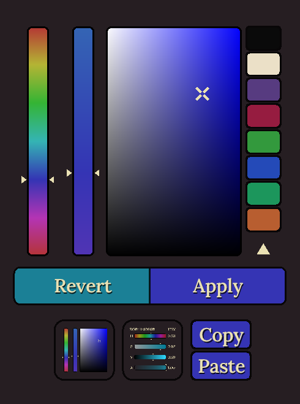

# Colour Picker

A basic colour picker written in C and [raylib][].

## Requirements
* C11 Compiler

## Installation

Run `build.sh` and copy `colourpicker` where you want it.

## Debug Hot Reloading

If `DEBUG` is set in the environment then the hot reloading
version will be compiled. The program will load `colourpicker.so`
at runtime and reload it when it is updated.

[raylib]: https://www.raylib.com/
